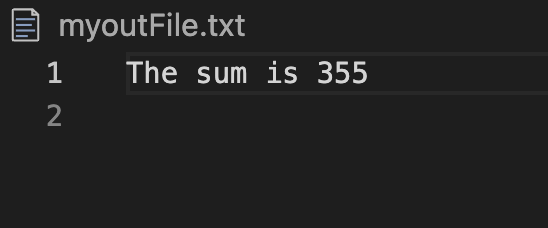

# Report - C Study

#### 202231495 최은렬
##### 20240212
---
### 2장 기본 자료구조 ( p.43 )
#### Version 1

```c
// 1,000 이하의 소수를 나열 ( 버전 1 )
#include <stdio.h>

int main(void)
{
	unsigned long counter = 0;  // 나눗셈 횟수
	for(int n = 2; n <= 1000; n++) {
        int i;
		for(i = 2; i < n; i++) {
			counter++;
			if(n % i == 0)     // 나누어떨어지면 소수가 아님
				break;     // 더 이상의 반복은 불필요
        }
		if(n == i)                 // 마지막까지 나누어떨어지지 않음
			printf("%d\n",n);
	}
	printf("나눗셈 실행횟수 : %lu\n", counter);

	return 0;
}
```
#### Output


#### Analysis
The most intuitive and simple coding method has the advantage of only writing code to obtain prime numbers, but it has the disadvantage of high time complexity by adding unnecessary calculations.
